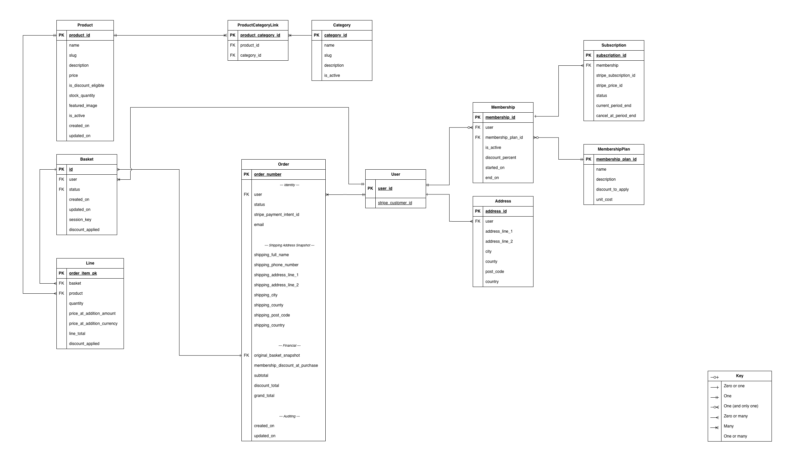

# Database Design

## Overview

Prop House uses a relational database schema designed to support:

- a browsable product catalogue with category grouping and stock tracking
- a persistent basket flow for authenticated and guest users
- a Stripe-backed checkout flow where orders are created only after successful payment
- membership plans that define discount offers
- user memberships that grant discount entitlements
- subscriptions that fund memberships
- customer account features such as saved addresses

The schema is intentionally split around distinct business concerns:

- **catalogue data** — what can be hired or purchased
- **basket and checkout data** — what a user is preparing to buy and what they actually bought
- **account data** — saved addresses and membership entitlement history
- **billing data** — Stripe identifiers and subscription lifecycle fields

---

## Stock Integrity Policy

- `Product.stock_quantity` is the authoritative stock value.
- Basket actions do **not** decrement database stock.
- The basket may show a user-facing “remaining after your basket” value, but this is presentation logic only.
- Stock is decremented **only** during successful paid checkout.
- Checkout should use an atomic transaction and row-level locking (`select_for_update`) to prevent overselling.

This keeps stock handling simple, auditable, and safe under concurrent checkout conditions.

---

## Entity Relationship Overview (Current Locked Schema)

### Core Relationships

- **Product ↔ Category**: many-to-many via `ProductCategoryLink`
- **User → Basket**: one-to-many in storage terms, though typically only one open basket should exist per user in application logic
- **Basket → Line**: one-to-many
- **Product → Line**: one-to-many
- **User → Order**: one-to-many
- **User → Address**: one-to-many
- **User → Membership**: one-to-many (history preserved)
- **Membership → MembershipPlan**: many-to-one
- **Membership → Subscription**: one-to-zero/one

### Important Domain Notes

- A basket may belong to a logged-in user **or** an anonymous session.
- Basket lines are the mutable, pre-purchase representation of selected products.
- Orders do **not** currently depend on live basket line relations. Instead, the order stores a purchase-time financial snapshot, including `original_basket_snapshot`.
- Membership history is preserved rather than overwritten, which supports auditing and future reporting.

---

## ERD

The current ERD uses crow's foot notation and includes the key in the diagram itself.

---

## Models

### Product (catalogue app)

Represents a hireable prop or equipment item.

Key fields:

- `product_id`
- `name`
- `slug`
- `description`
- `price`
- `is_discount_eligible`
- `stock_quantity`
- `featured_image`
- `is_active`
- `created_on`
- `updated_on`

Notes:

- A product may belong to multiple categories.
- `stock_quantity` should never fall below zero.
- `slug` should be unique and stable once created.
- `is_active` supports soft deactivation without deleting historical order data.

---

### Category (catalogue app)

Groups products into browsable sections.

Key fields:

- `category_id`
- `name`
- `slug`
- `description`
- `is_active`

Notes:

- Categories allow the catalogue to be organised without duplicating product records.
- Inactive categories can be hidden from the storefront while retaining relationships.

---

### ProductCategoryLink (catalogue app)

Join model for the Product ↔ Category many-to-many relationship.

Key fields:

- `product_category_id`
- `product_id` (FK → Product)
- `category_id` (FK → Category)

Notes:

- This explicit join model keeps the relationship visible in the schema.
- It also leaves room for future metadata on the relationship if needed.

---

### Basket (basket app)

Stores a mutable shopping basket linked either to a user or to an anonymous session.

Key fields:

- `id` (`UUIDField`, primary key)
- `user` (nullable FK → `auth.User`)
- `status`
- `created_on`
- `updated_on`
- `session_key` (nullable, indexed)

Status choices:

- `op` — Open
- `me` — Merged
- `sa` — Saved
- `su` — Submitted

Behaviour notes:

- A basket can exist before login and later be merged into a user basket.
- `handle_login_merge()` supports guest-to-user basket continuity.
- `merge_into()` consolidates basket lines inside a transaction.
- Basket state is intentionally separate from the order record.
- The basket is the working state; the order is the historical record.

Computed properties / behaviour:

- `total_price` returns a `Money` value in GBP based on current basket lines.
- `total_items` returns the summed quantity across all lines.
- `is_empty` checks whether the basket contains any related lines.
- Public `update()` delegates to `_add()`, `_remove()`, and `_clear()`.

Why this matters:

- This design supports guest baskets, login merges, and incremental basket updates without prematurely affecting stock.

---

### Line (basket app)

Represents a single product entry inside a basket.

Key fields:

- `basket` (FK → Basket)
- `product` (FK → `catalogue.Product`)
- `quantity`
- `price_at_addition` (`MoneyField`)

Constraints:

- `unique_together = ("basket", "product")`
- `quantity` is a positive integer

Behaviour notes:

- A basket can contain only one line per product; quantity is incremented instead of creating duplicates.
- `price_at_addition` snapshots the product price at the moment it was added to the basket.
- `line_total` is derived from `price_at_addition * quantity`.
- Basket updates use `F()` expressions when incrementing quantity to reduce race-condition risk from rapid repeated adds.

Why this matters:

- This model gives the basket a clean, normalised structure while preserving important pricing context at add-to-basket time.

---

### Order (commerce app)

Represents a completed transaction created after successful payment.

Key fields:

- `order_number` (PK / identity)
- `user` (FK → User)
- `status`
- `stripe_payment_intent_id`
- `email`

Shipping snapshot fields:

- `shipping_full_name`
- `shipping_phone_number`
- `shipping_address_line_1`
- `shipping_address_line_2`
- `shipping_city`
- `shipping_county`
- `shipping_post_code`
- `shipping_country`

Financial snapshot fields:

- `original_basket_snapshot`
- `membership_discount_at_purchase`
- `subtotal`
- `discount_total`
- `grand_total`

Audit fields:

- `created_on`
- `updated_on`

Behaviour notes:

- The order stores a historical snapshot rather than relying on mutable basket data after checkout.
- This protects purchase integrity even if prices, discounts, product status, or basket contents later change.
- Shipping details are duplicated into the order on purpose so past orders remain historically accurate.

---

### Address (profiles app)

A saved user address used for checkout autofill.

Key fields:

- `address_id`
- `user` (FK → User)
- `address_line_1`
- `address_line_2`
- `city`
- `county`
- `post_code`
- `country`

Notes:

- Addresses are reusable convenience records for the customer.
- Orders should still store their own shipping snapshot independently.

---

### MembershipPlan (catalogue or memberships-facing app)

Defines a membership offer available for purchase.

Key fields:

- `membership_plan_id`
- `name`
- `description`
- `discount_to_apply`
- `unit_cost`

Notes:

- This is the catalogue-level definition of the offer.
- It describes what the plan costs and what discount it grants.
- It should generally support activation/deactivation even if that flag is not yet shown in the ERD.

Example:

`Gold Membership — 10% off eligible products`

---

### Membership (accounts app)

Represents a user’s entitlement instance.

Key fields:

- `membership_id`
- `user` (FK → User)
- `membership_plan_id` (FK → MembershipPlan)
- `is_active`
- `discount_percent`
- `started_on`
- `end_on`

Notes:

- This is not just the plan definition; it is the user-specific record of entitlement.
- Multiple records may exist over time so membership history is preserved.
- Application logic should usually ensure that only one membership is active for a user at once.

---

### Subscription (commerce app)

Represents the Stripe billing contract backing a membership.

Key fields:

- `subscription_id`
- `membership` (FK → Membership)
- `stripe_subscription_id`
- `stripe_price_id`
- `status`
- `current_period_end`
- `cancel_at_period_end`

Notes:

- Subscription manages billing state.
- Membership manages entitlement state.
- Separating these concerns makes webhook handling and future billing changes easier to reason about.

---

## Data Operations Summary

### Catalogue Operations

- Staff/admin users create, update, publish, withdraw, or deactivate products.
- Staff/admin users create and manage categories.
- Product-category relationships are maintained through the join model.

### Basket Operations

- Users and guests can add products to a basket.
- Adding an existing product updates quantity instead of creating a duplicate line.
- Users can remove individual lines or clear the basket.
- Guest baskets can be merged into authenticated baskets on login or account confirmation.

### Checkout and Order Operations

- Checkout reads from the current basket.
- Successful payment creates an order containing shipping and financial snapshots.
- Stock is decremented only at this stage.
- The basket itself remains a separate mutable structure from the order history.

### Membership and Billing Operations

- Membership plans define the available offers.
- Membership records track entitlement over time.
- Subscription records track Stripe billing state and renewal/cancellation lifecycle.

### Address Operations

- Logged-in users can create, edit, and delete saved addresses for faster checkout.
- Orders do not depend on address records remaining unchanged after purchase.

---

## App Ownership Summary

- `core`: shared pages, site-wide layout, and general non-domain views such as home, contact, privacy, and other shared UI concerns
- `catalogue`: Product, Category, ProductCategoryLink, MembershipPlan
- `basket`: Basket, Line (Pre-checkout state, session/user-ownedtransient data)
- `commerce`: Order, Subscription, checkout flow, Stripe payment handling (post checkout state and payment lifecycle)
- `profiles`: Address and other customer-owned profile data such as wishlist if added
- `accounts`: Membership and authentication-adjacent account behaviour

This separation keeps each app aligned to a natural slice of the project:

- **core** handles shared site structure
- **catalogue** handles what can be browsed and hired
- **commerce** handles basket, payment, and completed purchase flow
- **profiles** handles saved customer data
- **accounts** handles user entitlement state

---

## Design Rationale

This schema is designed to match the real-world behaviour of PropHouse rather than forcing everything into a simplistic shop model.

Key design decisions include:

- **Explicit join model for categories** so the catalogue structure is clear and extensible.
- **Basket and line models separated from orders** so mutable shopping state does not contaminate historical purchase records.
- **Order snapshots** so financial and shipping history remain accurate over time.
- **Membership separated from subscription** so entitlement and billing can evolve independently.
- **Saved addresses separated from order shipping data** so convenience does not undermine auditability.
