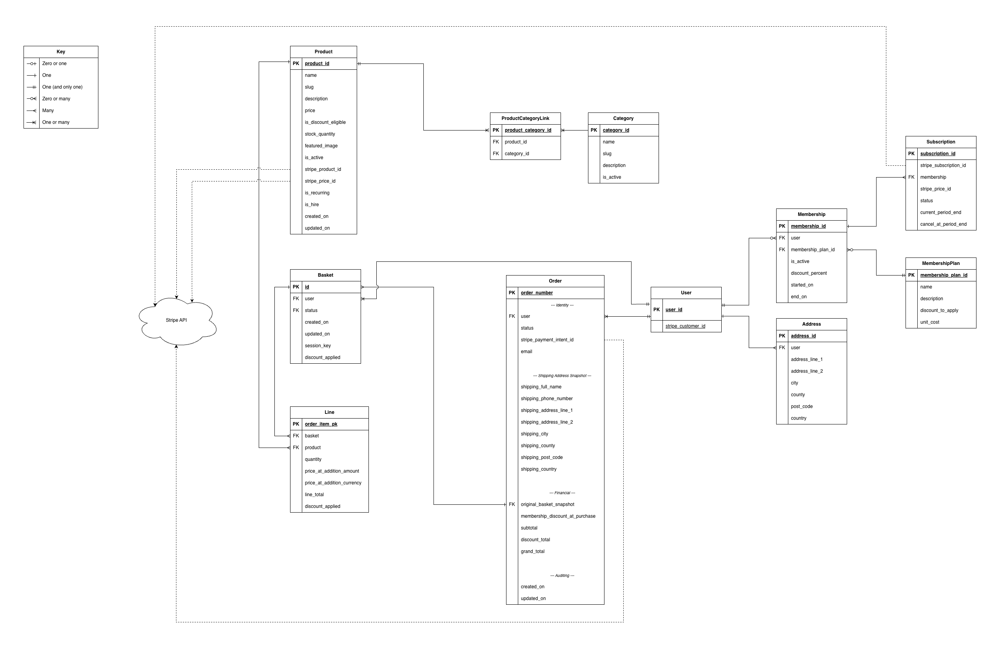

# Database Design

## Overview

Prop House uses a relational database schema designed to support:

- A browsable product catalogue with category grouping and stock tracking
- A persistent basket flow for authenticated and guest users
- A Stripe-backed checkout flow where orders are created only after successful payment
- Membership plans that define discount offers
- User memberships that grant discount entitlements
- Subscriptions that fund memberships
- Customer account features such as saved addresses

The schema is intentionally split around distinct business concerns:

- **catalogue data** — what can be hired or purchased
- **basket and checkout data** — what a user is preparing to buy and what they actually bought
- **account data** — saved addresses and membership entitlement history
- **billing data** — Stripe identifiers and subscription lifecycle fields

---

## Stock Integrity Policy

- `Product.stock_quantity` is the authoritative stock value.
- Basket actions do **not** decrement database stock.
- The basket may show a user-facing “remaining after your basket” value, but this is presentation logic only.
- Stock is decremented **only** during successful paid checkout.
- Checkout should use an atomic transaction and row-level locking (`select_for_update`) to prevent overselling.

This keeps stock handling simple, auditable, and safe under concurrent checkout conditions.

---

## Entity Relationship Overview (Current Locked Schema)

### Core Relationships

- **Product ↔ Category**: Many-to-many via `ProductCategoryLink`.
- **User → Basket**: One-to-many in storage terms, though typically only one open basket should exist per user in application logic.
- **Basket → Line**: One-to-many.
- **Product → Line**: One-to-many.
- **User → Order**: One-to-many.
- **User → Address**: One-to-many.
- **User → Membership**: One-to-many (history preserved).
- **Membership → MembershipPlan**: Many-to-one.
- **Membership → Subscription**: One-to-zero/one.

### Important Domain Notes

- A basket may belong to a logged-in user **or** an anonymous session.
- Basket lines are the mutable, pre-purchase representation of selected products.
- Orders do **not** currently depend on live basket line relations. Instead, the order stores a purchase-time financial snapshot, including `original_basket_snapshot`.
- Membership history is preserved rather than overwritten, which supports auditing and future reporting.
- **External Integrations**: Specific fields (prefixed with `stripe_`) act as remote foreign keys to the Stripe API.

---

## ERD

The current ERD uses crow's foot notation and includes the key in the diagram itself. It explicitly models the connection to the Stripe API.

---

## Models

### Product (catalogue app)

Represents a hireable prop or equipment item.

**Key fields:**

- `product_id` (PK)
- `name`, `slug`, `description`
- `price`
- `is_discount_eligible`
- `stock_quantity`
- `featured_image`
- `is_active`
- `stripe_product_id`: Stripe Product ID (`prod_...`)
- `stripe_price_id`: Stripe Price ID (`price_...`)
- `is_hire`: Logic flag for hire workflows
- `created_on`, `updated_on`

---

### Category (catalogue app)

Groups products into browsable sections.

**Key fields:**

- `category_id` (PK)
- `name`, `slug`, `description`, `is_active`

---

### ProductCategoryLink (catalogue app)

Join model for the Product ↔ Category many-to-many relationship.

**Key fields:**

- `product_category_id` (PK)
- `product_id` (FK → Product)
- `category_id` (FK → Category)

---

### Basket (basket app)

Stores a mutable shopping basket linked either to a user or to an anonymous session.

**Key fields:**

- `id` (UUID PK)
- `user` (nullable FK → User)
- `status` (Open, Merged, Saved, Submitted)
- `created_on`, `updated_on`
- `session_key` (nullable, indexed)

---

### Line (basket app)

Represents a single product entry inside a basket.

**Key fields:**

- `order_item_pk` (PK)
- `basket` (FK → Basket)
- `product` (FK → Product)
- `quantity`
- `price_at_addition_amount`
- `price_at_addition_currency`
- `line_total`
- `discount_applied`

---

### Order (commerce app)

Represents a completed transaction created after successful payment.

**Key fields:**

- `order_number` (PK)
- `user` (FK → User)
- `status`
- `stripe_payment_intent_id`: Remote reference for Stripe payment confirmation
- `email`

**Shipping snapshot fields:**

- `shipping_full_name`, `shipping_phone_number`, `shipping_address_line_1`, `shipping_address_line_2`, `shipping_city`, `shipping_county`, `shipping_post_code`, `shipping_country`

**Financial snapshot fields:**

- `original_basket_snapshot` (FK → Basket)
- `membership_discount_at_purchase`, `subtotal`, `discount_total`, `grand_total`

---

### Address (profiles app)

A saved user address used for checkout autofill.

**Key fields:**

- `address_id` (PK)
- `user` (FK → User)
- `address_line_1`, `address_line_2`, `city`, `county`, `post_code`, `country`

---

### MembershipPlan (catalogue app)

Defines a membership offer available for purchase.

**Key fields:**

- `membership_plan_id` (PK)
- `name`, `description`, `discount_to_apply`, `unit_cost`

---

### Membership (accounts app)

Represents a user’s entitlement instance.

**Key fields:**

- `membership_id` (PK)
- `user` (FK → User)
- `membership_plan_id` (FK → MembershipPlan)
- `is_active`, `discount_percent`, `started_on`, `end_on`

---

### Subscription (commerce app)

Represents the Stripe billing contract backing a membership.

**Key fields:**

- `subscription_id` (PK)
- `membership` (FK → Membership)
- `stripe_subscription_id`: Remote reference to Stripe subscription
- `stripe_price_id`: Remote reference to the Stripe price being billed
- `status`, `current_period_end`, `cancel_at_period_end`

---

### User (auth/custom)

**Extended fields:**

- `stripe_customer_id`: Unique identifier for the Stripe Customer object

---

## App Ownership Summary

- **core**: Shared UI and site-wide logic.
- **catalogue**: `Product`, `Category`, `ProductCategoryLink`, `MembershipPlan`.
- **basket**: `Basket`, `Line`.
- **commerce**: `Order`, `Subscription`, Stripe lifecycle handling.
- **profiles**: `Address`.
- **accounts**: `Membership`, custom User attributes.
