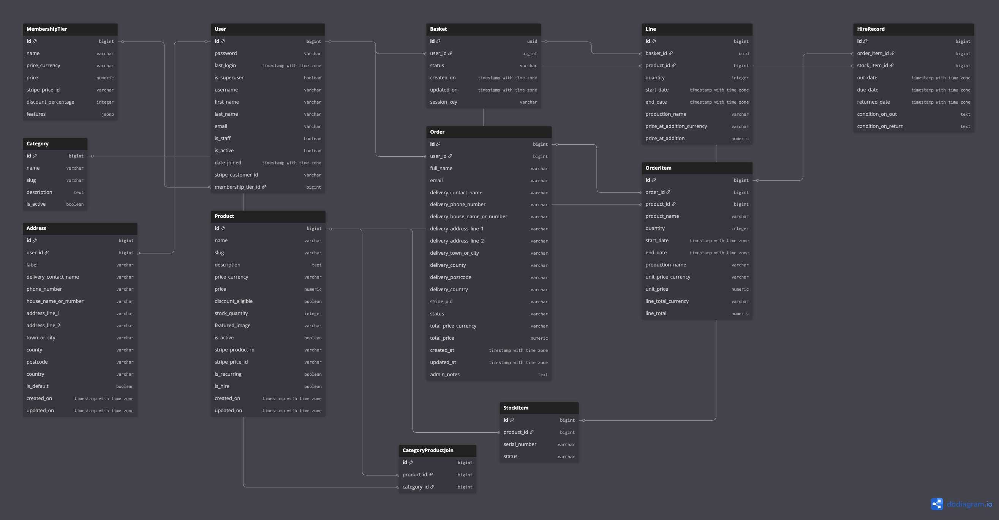

# Database Design

## Overview

PropHouse uses a relational database schema designed to support:

- A browsable catalogue of hireable props and equipment.
- Membership-based pricing and customer discounts.
- Persistent basket management for authenticated and guest users.
- Stripe-backed checkout and payment processing.
- Order fulfilment and hire lifecycle tracking.
- Physical inventory management through individual stock records.

The schema is intentionally separated into distinct business domains:

- **catalogue data** — products, categories, and pricing information.
- **customer data** — user accounts, membership tiers, and saved delivery addresses.
- **basket data** — pre-purchase selections and pricing snapshots.
- **commerce data** — completed orders and purchased items.
- **warehouse data** — physical inventory management and hire tracking.
- **external integrations** — Stripe product, price, customer, and payment identifiers.

---

## Stock Integrity Policy

`Product.stock_quantity` is the customer-facing stock value displayed throughout the application.

Individual physical inventory units are represented separately through the `StockItem` model.

This dual-layer approach allows PropHouse to:

- Display aggregate stock availability to customers.
- Maintain warehouse-level tracking of individual physical items.
- Associate specific stock units with hire records.
- Support future serialised inventory workflows.

Stock is not decremented when items are added to a basket.

Instead:

- Basket actions only affect presentation and reservation calculations.
- Stock validation occurs during checkout.
- Stock allocation occurs during fulfilment.
- Checkout uses transactional database operations to prevent overselling.

---

## Entity Relationship Overview

### Customer Domain

- `MembershipTier` > `User`: One-to-many.
- `User` > `Address`: One-to-many.
- `User` > `Basket`: One-to-many.
- `User` > `Order`: One-to-many.

### Catalogue Domain

- `Product` <> `Category`: Many-to-many via `CategoryProductJoin`.
- `Product` > `StockItem`: One-to-many.

### Basket Domain

- `Basket` > `Line`: One-to-many.
- `Product` > `Line`: One-to-many.

### Commerce Domain

- `Order` > `OrderItem`: One-to-many.
- `Product` > `OrderItem`: One-to-many.

### Warehouse Domain

- `StockItem` > `HireRecord`: One-to-many.
- `OrderItem` > `HireRecord`: One-to-many.

---

## ERD

The following Entity Relationship Diagram (ERD) was generated using DBML (Database Markup Language) and rendered using dbdiagram.io.

The schema was originally designed during the planning phase of the project and then refined throughout development as the understanding of the business domain evolved. Several iterations were produced as new requirements emerged, particularly around inventory management, fulfilment workflows, membership pricing, and hire tracking.

The final ERD shown below reflects the completed implementation and should be considered the authoritative representation of the deployed database schema.

While database design is ideally established before development begins, the iterative nature of the project meant that the schema evolved alongside the application. The final diagram therefore represents both the original design intent and the lessons learned during implementation.

---

## Models

### `MembershipTier` (`accounts` app)

Defines membership pricing and discount entitlements.

#### Key Fields

- `id`
- `name`
- `price`
- `discount_percentage`
- `stripe_price_id`
- `features`

#### Notes

`MembershipTier` records provide customer discount benefits and are linked directly to `User` accounts.

---

### `User` (`accounts` app)

Custom authentication model extending Django's user system.

#### Key Fields

- `id`
- `username`
- `email`
- `stripe_customer_id`
- `membership_tier`

#### Notes

Stores Stripe customer references and active membership tier assignments.

---

### `Address` (`accounts` app)

Stores reusable customer delivery address details for authenticated users.

#### Key Fields

- `id`
- `user`
- `label`
- `delivery_contact_name`
- `phone_number`
- `house_name_or_number`
- `address_line_1`
- `address_line_2`
- `town_or_city`
- `county`
- `postcode`
- `country`
- `is_default`
- `created_on`
- `updated_on`

#### Notes

`Address` records allow authenticated customers to save reusable delivery details for checkout.

A user may have multiple saved addresses, but application business logic ensures that only one address is treated as the default address at a time. This supports faster repeat checkout while keeping delivery details customer-owned and separate from completed order records.

---

### `Category` (`catalogue` app)

Provides product grouping and catalogue organisation.

#### Key Fields

- `id`
- `name`
- `slug`
- `description`
- `is_active`

---

### `Product` (`catalogue` app)

Represents a hireable or purchasable catalogue item.

#### Key Fields

- `id`
- `name`
- `slug`
- `description`
- `price`
- `discount_eligible`
- `stock_quantity`
- `featured_image`
- `is_active`
- `is_hire`
- `is_recurring`
- `stripe_product_id`
- `stripe_price_id`

#### Notes

`Product` records represent commercial catalogue entries rather than individual physical inventory units.

---

### `CategoryProductJoin` (`catalogue` app)

Join model implementing the `Product` <> `Category` many-to-many relationship.

#### Key Fields

- `id`
- `product`
- `category`

---

### `Basket` (`basket` app)

Represents an active shopping basket.

#### Key Fields

- `id`
- `user`
- `status`
- `session_key`
- `created_on`
- `updated_on`

#### Notes

`Basket` supports both authenticated and anonymous customer workflows.

---

### `Line` (`basket` app)

Represents a single product within a basket.

#### Key Fields

- `id`
- `basket`
- `product`
- `quantity`
- `start_date`
- `end_date`
- `production_name`
- `price_at_addition`

#### Notes

`Line` acts as a mutable pre-purchase representation of customer selections.

---

### `Order` (`commerce` app)

Represents a completed checkout transaction.

#### Key Fields

- `id`
- `user`
- `full_name`
- `email`
- `delivery_contact_name`
- `delivery_phone_number`
- `delivery_house_name_or_number`
- `delivery_address_line_1`
- `delivery_address_line_2`
- `delivery_town_or_city`
- `delivery_county`
- `delivery_postcode`
- `delivery_country`
- `stripe_pid`
- `status`
- `total_price`
- `admin_notes`

#### Notes

`Order` records are created after successful payment confirmation.

Delivery details are stored directly on the order as purchase-time snapshots. This preserves the exact address used for fulfilment even if the customer later edits or deletes their saved address.

---

### `OrderItem` (`commerce` app)

Represents a purchased product within an order.

#### Key Fields

- `id`
- `order`
- `product`
- `product_name`
- `quantity`
- `start_date`
- `end_date`
- `unit_price`
- `line_total`

#### Notes

`OrderItem` stores purchase-time snapshots to preserve historical accuracy.

---

### `StockItem` (`warehouse` app)

Represents an individual physical inventory unit.

#### Key Fields

- `id`
- `product`
- `serial_number`
- `status`

#### Notes

`StockItem` allows warehouse operations to track physical assets independently of catalogue products.

---

### `HireRecord` (`warehouse` app)

Represents the lifecycle of a hired inventory item.

#### Key Fields

- `id`
- `order_item`
- `stock_item`
- `out_date`
- `due_date`
- `returned_date`
- `condition_on_out`
- `condition_on_return`

#### Notes

`HireRecord` links purchased `OrderItem` records to specific `StockItem` units and records hire activity throughout the fulfilment lifecycle.

---

## App Ownership Summary

- **core**: Shared UI, static pages, site-wide templates, HTMX integrations, and general platform concerns.
- **accounts**: `User`, `MembershipTier`, and `Address`.
- **catalogue**: `Product`, `Category`, and `CategoryProductJoin`.
- **basket**: `Basket` and `Line`.
- **commerce**: `Order`, `OrderItem`, checkout processing, and Stripe payment handling.
- **warehouse**: `StockItem` and `HireRecord`.
